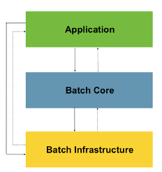

# 스프링 배치 
## 챕터 2
### 스프링 배치 아키텍처

1. **Application** : 배치 프레임워크를 통해 개발자가 만든 모든 배치 Job과 커스텀 코드를 포함
	+ 개발자는 업무로직의 구현에만 집중, 공통 기반기술은 프레임워크가 담당
2. **Batch Core** : Job을 싱행, 모니터링, 관리하는 API로 구성되어있다.
	+ JobLauncher, Job, Step, Flow 등이 속한다. 
3. **Batch Infrastructure** : Application, Core  모두 공통 Infrastructure 위에서 빌드된다.
	+ Job 실행의 흐름과 처리를 위한 틀을 제공 (Reader, Processor Writer, Skip, Retry 등이 속한다.)

### 스프링 배치 초기화 설정 클래스

`@EnableBatchProcessing` 어노테이션을 통해서 스프링 배치 자동 설정을 처리할 때 위와 같이 `BatchConfigurationSelector` 를 통하여 `ModularBatchConfiguration` 혹은 `SimpleBatchConfiguration` 가 로드된다.

1. **BatchAutoConfiguration** : 스프링 배치가 초기화 될 때 자동으로 실행되는 설정 클래스
2.  **SimpleBatchConfiguration** : `JobBuilderFactory` 와 `StepBuilderFactory` 를 통하여 스프링 배치의 주요 구성 요소 생성한다. 
	+ 프록시 객체로 생성됨
3. **BatchConfigurerConfiguration** 
	+ **BasicBatchConfigurer** : `SimpleBatchConfiguration` 에서 생성한 프록시 객체의 실제 대상 객체를 생성하는 설정 클래스
		+ 빈으로 의존성 주입 받아 주요 객체들 참조 사용가능
	+ **JpaBatchConfigurer** : JPA 관련 객체를 생성하는 설정 클래스

### 스프링 배치 일감 구성 요소

+ Job이 구동되면 Step을 실행하고 Step이 구동되면 Tasklet을 실행하도록 설정함. 

1. **Job** :  배치의 일 혹은 일감으로 배치 프로세스는 이 일감을 처리하는 역할을 한다.
2. **Step** :  일감안에서의 일련의 흐름 혹은 단계로 Job은 각각의 스텝이 일련의 순서대로 처리되는 것을 뜻한다.
3. **Tasklet** : Step 내부에서 처리되는 작업 내용을 뜻한다.

#강의정리#