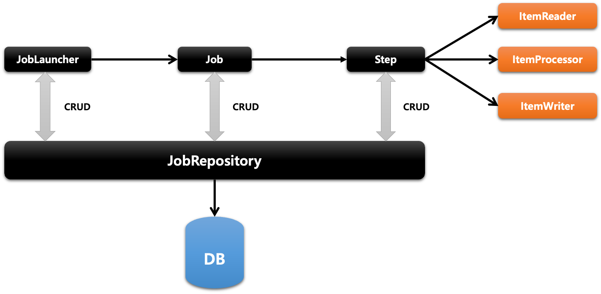
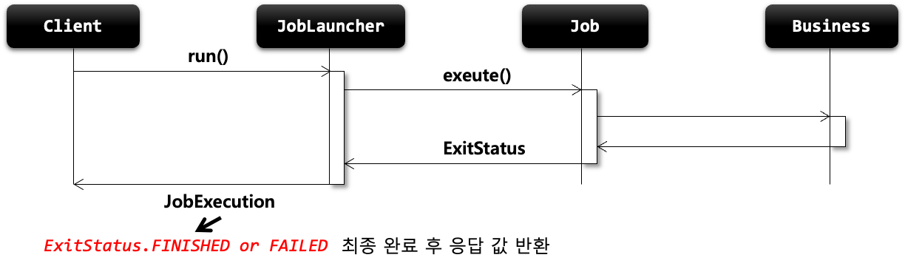
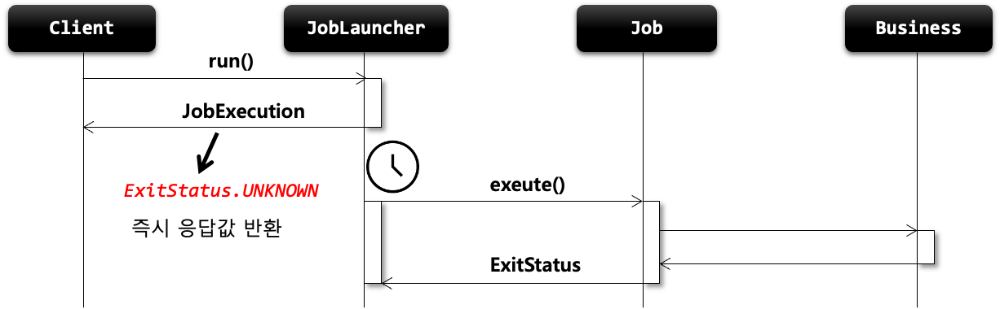

# 스프링 배치
## 챕터 2
### 스프링 배치 아키텍처


1. **Application** : 배치 프레임워크를 통해 개발자가 만든 모든 배치 Job과 커스텀 코드를 포함
	+ 개발자는 업무로직의 구현에만 집중, 공통 기반기술은 프레임워크가 담당
2. **Batch Core** : Job을 싱행, 모니터링, 관리하는 API로 구성되어있다.
	+ JobLauncher, Job, Step, Flow 등이 속한다.
3. **Batch Infrastructure** : Application, Core  모두 공통 Infrastructure 위에서 빌드된다.
	+ Job 실행의 흐름과 처리를 위한 틀을 제공 (Reader, Processor Writer, Skip, Retry 등이 속한다.)

### 스프링 배치 초기화 설정 클래스


`@EnableBatchProcessing` 어노테이션을 통해서 스프링 배치 자동 설정을 처리할 때 위와 같이 `BatchConfigurationSelector` 를 통하여 `ModularBatchConfiguration` 혹은 `SimpleBatchConfiguration` 가 로드된다.

1. **BatchAutoConfiguration** : 스프링 배치가 초기화 될 때 자동으로 실행되는 설정 클래스
2.  **SimpleBatchConfiguration** : `JobBuilderFactory` 와 `StepBuilderFactory` 를 통하여 스프링 배치의 주요 구성 요소 생성한다.
	+ 프록시 객체로 생성됨
3. **BatchConfigurerConfiguration**
	+ **BasicBatchConfigurer** : `SimpleBatchConfiguration` 에서 생성한 프록시 객체의 실제 대상 객체를 생성하는 설정 클래스
		+ 빈으로 의존성 주입 받아 주요 객체들 참조 사용가능
	+ **JpaBatchConfigurer** : JPA 관련 객체를 생성하는 설정 클래스

### 스프링 배치 일감 구성 요소


+ Job이 구동되면 Step을 실행하고 Step이 구동되면 Tasklet을 실행하도록 설정함.

1. **Job** :  배치의 일 혹은 일감으로 배치 프로세스는 이 일감을 처리하는 역할을 한다.
2. **Step** :  일감안에서의 일련의 흐름 혹은 단계로 Job은 각각의 스텝이 일련의 순서대로 처리되는 것을 뜻한다.
3. **Tasklet** : Step 내부에서 처리되는 작업 내용을 뜻한다.

# Spring Batch 도메인 객체
+ 스프링 배치에는 도메인을 크게 2가지로 분류 할 수 있다.
	+ Job을 만들 때 여러 설정하고, 단계, 처리 및 결과를 내기 위한 도메인들
		+ e.g) Job, Step, Flow, Tasklet 등
	+ 각 시점 및 단계마다 상태(메타데이터)를 데이터베이스에 저장하기 위한 도메인들
		+ e.g) JobInstance, JobExecution, StepExecution 등

## Job 도메인
+ 배치 계층 구조에서 가장 상위에 있는 개념으로서 하나의 배치작업 자체를 의미
+ 특징
	+ `Job Configuration` 으로 생성되는 객체 단위로서 배치작업을 어떻게 구성하고, 실행할 것인지 전체적으로 설정하고 명세한 객체
	+ 여러 Step을 포함하고 있는 컨테이너로서 반드시 한개 이상의 Step으로 구성해야함

+ 구현체
	+ `SimpleJob`
		+ 순차적으로 Step을 실행시키는 Job
	+ `FlowJob`
		+ 특정한 조건과 흐름에 따라 Step을 구성하여 실행시키는 Job
		+ Flow 객체를 실행시켜서 작업을 진행

+ 실행 흐름
  
## JobInstance 도메인
+ Job이 실행될 때 생성되는 Job의 논리적 실행 단위 객체로서 고유하게 식별 가능한 작업 실행을 나타냄.
+ Job의 설정과 구성은 동일하지만 **Job이 실행되는 시점에 처리하는 내용은 다르기 때문에 Job의 실행을 구분해야함**.
	+ 하루에 한 번씩 동작하는 배치 Job이 존재하면 매일 실행되는 각각의 Job을 JobInstance로 표현.
+ JobInstance 생성 및 실행
	+ 처음 시작하는 Job + JobParameter일 경우 새로운 JobInstance 생성
	+ 이전과 동일한 Job + JobParameter으로 실행할 경우 이미 존재하는 JobInstance 리턴
		+ 내부적으로 JobName + JobKey를 가지고 JobInstance 객체를 얻음
+ Job과는 ::1:N 관계::
  -> JobInstance는 `BATCH_JOB_INSTANCE` 테이블과 매핑

+ 실행흐름


## JobParameter 도메인
+ Job을 실행 할 때 함께 포함되어 사용되는 파라미터를 가진 도메인 객체
	+ `JobLauncher` 가 처리될 때 Job과 함께 인자로 전달되어서 사용되는데 이는 여러개의 JobInstance를 구분하기 위해서이다.
	+ JobParameters와 JobInstance는 ::1:1:: 관계

+ 생성 및 바인딩
	+ 어플리케이션 실행 시 주입
		+ `java -jar LogBatch.jar requestDate=20210101`
	+ 코드로 생성
		+ `JobParamterBuilder, DefaultJobParametersConverter`
	+ SpEL 이용
		+ `@Value("#{jobParameter[requestDate]"}), @JobScope, @StepScope 선언 필수`

+ `BATCH_JOB_EXECUTION_PARAM` 테이블과 매핑
	+ `JOB_EXECUTION` 과 ::1:N:: 관계

+ 도메인 구조


## JobExecution 도메인
+ JobInstance에 대한 한번의 시도를 의미하는 객체로서 Job 실행 중에 발생한 정보들을 저장하고 있는 객체

+ JobInstance 과의 관계
	+ JobExecution은 `FAILED` 또는 `COMPLETED` 등의 Job 실행 결과 상태를 가지고 있음.
	+ JobExecution의 실행 상태 결과가 `COMPLETED` 면 JobInstance 실행이 완료된 것으로 간주하여 재실행 불가
	+ `FAILED` 면 재실행이 가능하다.
		+ JobParameter가 동일한 값으로 실행해도 재실행 가능하다.
	+ `COMPLETED` 될 때까지 하나의 JobInstance 내에서 여러 번의 시도가 생길 수 있음.

+ `BATCH_JOB_EXECUTION` 테이블과 매핑
	+ JobInstance와 JobExecution 은 ::1:N:: 관계

+ 도메인 구조  
  

+ 실행 흐름
  

## Step 도메인
	+ 실제 배치 처리를 정의하고 컨트롤하는 데 필요한 모든 정보를 가지고 있는 도메인 객체 (각 Job의 독립적인 하나의 단계)
	+ 배치작업을 어떻게 구성하고 실행할 것인지 Job의 세부 작업을 Task 기반으로 설정하고 명세해놓은 객체
	+ 모든 Job은 하나 이상의 Step으로 구성되어 있음.

+ 구현체
	+ `TaskletStep` : 가장 기본이 되는 클래스로, `Tasklet` 타입의 구현체들을 제어
	+ `PartitionStep` : 멀티 쓰레드 방식으로 Step을 여러개 분리해서 실행
	+ `JobStep` : Step 내에서 Job을 실행
	+ `FlowStep` : Step 내에서 Flow를 실행


+ 도메인 구조
  


+ API 설정에 따른 각 Step 생성

```java
public Step taskletStep() {
	return this.stetpBuilderFactory.get("step")
					.tasklet(myTasklet()) // taskletStep 생성 
					.build();
}

public Step taskletStep() {
	return this.stetpBuilderFactory.get("step")
					.<Member, Member> chunk(100) //ChunkedOrientedTasklet을 실행 
					.reader(reader())
					.writer(writer()) 
					.build();
}

public Step jobStep() {
	return this.stepBuilderFactory.get("step")
					.job(job()) // Step 내부에서 job 실행
					.launcher(jobLauncher)
					.paramters(jobParameterExtractor()) 
					.build();
}


```

## StepExecution 도메인
+ Step에 대한 한번의 시도를 의미하는 객체로서 Step 실행 중에 발생한 정보들을 저장하고 있는 객체
	+ Step은 StepInstance 객체는 따로 존재하지는 않는다.
	+ 시작시간, 종료시간, 상태(시작됨, 완료, 실패), commit count, rollback count 등의 속성을 가짐
+ Step이 매번 시도될 때마다 생성되며, 각 Step 별로 생성된다.
	+ JobExecution과 동일하게 성공한 Step은 재 실행되지않고, 실패한 Step만 실행된다.
		+ 이전 단계 Step이 실패해서 현재 Step을 실행하지 않았다면 StepExecution을 생성하지않고, Step이 실제로 시작됐을 때만 생성한다. (이전 단계의 스텝이 실패해서(이전 단계의 스텝은 실행 중 실패했으므로 StepExecution은 생성된다.), 현재 단계의 스텝이 시작되지 않을 경우 생성 X)
	+ JobExecution과 관계
		+ **Step의 StepExecution이 모두 정상적으로 완료 되어야 JobExecution이 정상적으로 완료된다.**
		+ **Step의 StepExecution 중 하나라도 실패하면 JobExecution은 실패한다.**
+ `BATCH_STEP_EXECUTION` 테이블과 매핑
	+ JobExecution과 StepExecution은 ::1:N:: 관계
	+ 하나의 Job에 여러 개의 Step으로 구성했을 경우, 각 StepExecution은 하나의 JobExecution을 부모로 가진다.

+ 실행 흐름
  

+ 도메인 구조
  


## StepContribution 도메인
	+ 청크 프로세스(`Tasklet`도 포함된다)의 변경 사항을 버퍼링 한 후 StepExecution 상태를 업데이트하는 도메인 객체
		+ 청크 커밋 직전에 StepExection의 apply 메서드를 호출하여 상태 업데이트 
		+ ExitStatus의 기본 종료코드 외 사용자 정의 종료코드를 생성해서 적용할 수 있음 

+ 실행 흐름
  

## ExecutionContext 도메인
+ 프레임워크에서 유지 및 관리하는 키/값으로 된 컬렉션으로 StepExecution 혹은 JobExecution의 객체의 상태를 저장하는 공유 객체
+ DB에 직렬화한 값으로 저정됨
  + 공유 범위
      + Step 범위 - 각 Step의 StepExecution에 저장되며 Step 간 서로 공유 X
      + Job 범위 - 각 Job의 JobExecution에 저장되며 Job간 서로 공유 X
          + 단, Job의 Step간 서로 공유 O
  + Job 재 시작시 이미 처리한 Row 데이터는 건너뛰고 이후로 수행하도록 할 때 상태 정보로 활용

+ 도메인 구조
  

+ 실행 흐름
  

## JobRepository 도메인
+ 배치 작업 중 정보를 저장하는 저장소 역할
	+ Job이 언제 수행되었고, 언제 끝났으며, 몇 번이 실행되었고 실행에 대한 결과 등의 배치 작업의 수행과 관련된 모든 meta data를 저장함.
		+ JobLauncher, Job, Step 구현체 내부에서 CRUD 기능을 처리함.

+ 도메인 구조
  

+ JobRepository
	+ `@EnableBatchProcessing` 어노테이션 선언 시 JobRepository 자동 빈 생성
	+ BatchConfigurer 인터페이스를 구현하거나 BasicBatchConfigurer를 상속해서 커스터마이징 가능
		+ **JDBC 방식 - JobRepositoryFactoryBean**
			+ 내부적으로 AOP 기술을 통해 트랜잭션 처리를 해줌
			+ 트랜잭션 isolation level의 기본 값은 `SERIALIZEBLE` , 다른 레벨로 지정 가능하긴 하다.
			+ 메타테이블의 Table Prefix를 변경할 수 있음. 기본 값은 `BATCH_`

```java
@Override
protected JobRepository createJobRepository() throws Exception {
    JobRepositoryFactoryBean factory = new JobRepositoryFactoryBean();
    factory.setDataSource(dataSource);
    factory.setTransactionManager(transactionManager);
	factory.setIsolationLevelForCreate("ISOLATION_SERIALIZABLE"); // isolation 수준, 기본값은 “ISOLATION_SERIALIZABLE”
    factory.setTablePrefix(“SYSTEM_"); // 테이블 Prefix, 기본값은 “BATCH_”, BATCH_JOB_EXECUTION 가 SYSTEM_JOB_EXECUTION 으로 변경됨
    factory.setMaxVarCharLength(1000); // varchar 최대 길이(기본값 2500)
    return factory.getObject(); // Proxy 객체가 생성됨 (트랜잭션 Advice 적용 등을 위해 AOP 기술 적용)
}
```

+ **In Memory 방식 - MapJobRepositoryFactoryBean**
  + 성능 등의 이유로 도메인 오브젝트를 굳이 데이터베이스에 저장하고 싶지 않을 경우
  + 보통 테스트나 프로토타입의 빠른 개발이 필요할 때 사용

```java
@Override
protected JobRepository createJobRepository() throws Exception {
    MapJobRepositoryFactoryBean factory = new MapJobRepositoryFactoryBean();
    factory.setTransactionManager(transactionManager); // ResourcelessTransactionManager 사용
    return factory.getObject();
}
```


## JobLauncher 도메인
+ 배치 Job을 실행시키는 역할을 한다.
+ Job과 Job Parameters를 인자로 받으며, 요청된 배치 작업을 수행한 후 최종 client에게 JobExecution을 반환함.


+ Job 실행
  + 스프링 부트 배치가 구동되면 JobLauncherApplicationRunner가 자동적으로 JobLauncher 실행
    + **동기적 실행**
        + taskExecutor를 SyncTaskExecutor로 설정
            + JobExecution을 획득 후 배치 처리를 최종 완료한 이후 Client에게 JobExecution을 반환
        + **스케줄러에 의한 배치처리에 적합(배치처리가 길어도 상관 X)**
		
    + **비동기적 실행** 
        + taskExecutor를 SimpleAsyncTaskExecutor로 설정
            + JobExecution을 획득 후 Client에게 바로 JobExecution을 반환하고 배치처리를 완료한다.
            + **HTTP 요청에 의한 배치처리에 적합(배치처리 시간이 길 경우 응답이 늦어지지 않도록)**

### 동기적 실행



### 비동기적 실행

